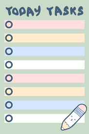

# PROJINDA24
The repository is my project assignment for my first year in data engineering. It is an interactive calendar intended
to help students to better organise their days.

### Introduction
Students in university often struggle with time management, especially during their first year.
To help students with their planning during tight schedules this projects aims to make planning efficient and easily accessible for students.

### Project idea
An interactive planner/calendar with these features:
* Hamburger menu that updates every day.
  * Shows today's tasks that the student has noted or events
    * "Study Math", "Laundry" , "Vårbal"
    * Easily accessed from home page
* A Calendar, where each day has a linked page where all tasks are illustrated
  * each noted thing can be a `Task` , `Event`, `Chore` or `School`

* For tasks, students can start growing a plant, and the idea is that the student can't use their device or else the plant dies
* Events are highlighted in the hamburger menu, to give an optimistic feel when student looks
* A chores are also highlighted

### Project composition
#### Main : CalendarP.java
* Is the homepage for the planner application
* Contains a calendar, which is a link to a new frame for each day
* To the right of it is the hamburger menu.
* Hamburger menu will look something like the following: 
  * 
* This will have all the dates, weekdays, month and year.
* It will be displayed in the following format:
  * 
  * 
* If you want to switch month or plan ahead you can switch month by either swiping
or if I add a features in the top menu where one can change month and year
* Each day is clickable and has a page linked to it

#### Day
* A class and frame that stores daily tasks in an ArrayList
* Contains a daily calendar
* Adds and removes elements

#### DailyEvent
* A class that is represents an event
* Has a name, type , start and end time

#### EventGUI
* A class that adds elements to a Day objects list with daily events

#### RemoveEventGUI
* A class that removes elements from a Day objects list of daily events

#### EventListener
* Interface that prompts an action to happen to the Day object when called in EventGUI and RemoveEventGUI

#### DayDesign
* A class displaying the graphics of the daily calendar
* Also handles the drawing of panels logic

