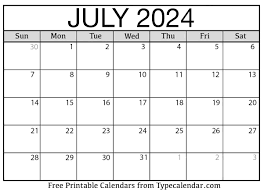

# PROJINDA24
The repository is my project assignment for my first year in computer engineering. It is an interactive calendar made for students in university

### Introduction
Students in university will often struggle with time management especially during their first year.
To help students with their planning and making it customed to their tight schedules and intense schedule
this projects aims to make planning efficient and easily accessible for students.

### Project idea
An interactive planner/calendar with these features:
* Hamburger menu that updates every day
  * Shows today's tasks that the student has noted or events
    * "Study Math", "Laundry" , "Vårbal"
* A Calendar, where each day has a linked page where all tasks are illustrated
  * each noted thing can be a `Task` , `Event`, `Chore` or `Other`

* For tasks, students can start growing a plant, and the idea is that the student can't use their device or else the plant dies
* Events are highlighted in the hamburger menu, to give a optimistic feel when student looks
* A chores are also highlighted

### Project composition
#### Main : Planner.java
* Here is the homepage for the planner application
* On the planner page there will be a calender.
* To the right of it is the hamburger menu.
* Also stores effective study plans if students desire

#### Calendar.java
* This will have all the dates, weekdays, month and year.
* It will be displayed in the following format:
  * 
  * 
* If you want to switch month or plan ahead you can switch month by either swiping
or if I add a features in the top menu where one can change month and year
* Each day is clickable and has a page linked to it

#### Page.java
* Has tasks
* Has events
* Has chores
* Has others
* For the student to note important things and schedule their day

#### Type.java
* Stores what type a task/event/chore is
* Can be a task, event, chore or simply other which will be a note

